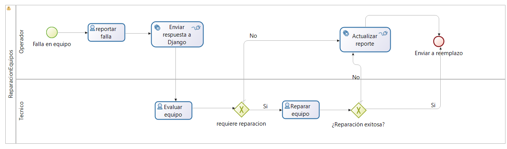
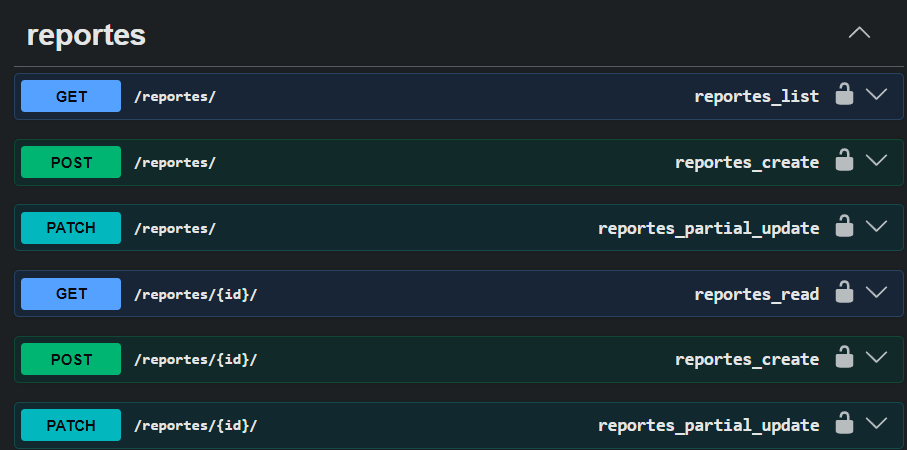

# BackendDjangoAPI - HospitalLINK

Equipo: HospitalLINK

Integrantes:
- Alex Enrique Cañapataña Vargas
- Berly Miuler Dueñas Mandamientos

Cliente: Hospital Honorio Delgado

Resumen
-------
Backend REST en Python (Django + Django REST Framework) que implementa los servicios necesarios para soportar tareas automáticas de procesos BPMN (orquestados por Bonitasoft). El sistema sigue principios de Domain‑Driven Design (DDD) y está diseñado como un servicio guiado por eventos que se comunica de forma asíncrona con el orquestador mediante RabbitMQ.

Visión general (qué y para quién)
-------------------------------
Este repositorio proporciona:
- Endpoints REST para registrar consultas ambulatorias y gestionar pacientes.
- Un consumer/publisher para integrar procesos BPMN con servicios internos a través de RabbitMQ.
- Documentación OpenAPI (Swagger) para probar y validar los servicios.

Stack
-----
- Lenguaje: Python
- Framework: Django / Django REST Framework
- Documentación OpenAPI: Swagger UI
- Mensajería: RabbitMQ
- Persistencia: SQLite / Django ORM
- Dependencias notables: Django, djangorestframework, pika

Estructura principal del repositorio
-----------------------------------

```text
apps/
  consultorio_externo/         # Módulo Consultorio Externo (DDD por capas)
    domain/                    # Entidades, ValueObjects, Factories, Exceptions
      entities.py
      value_objects.py
      factories.py
      exceptions.py
    application/               # Casos de uso / servicios de aplicación
      services.py              # RegistrarConsultaService
      consumers.py             # RabbitMQ consumer (integration)
    infrastructure/            # Acceso a infra (ORM, publisher)
      repositories.py
      rabbitmq_publisher.py    # Publicador que envía "true"/"false" en texto plano
    presentation/              # API (views + serializers)
      views.py                 # Endpoints REST y schemas Swagger
      serializers.py
    models.py                  # Models Django (Paciente ORM)
  mantenimiento_biomedico/     # Módulo Mantenimiento Biomédico (DDD)
    domain/                    # Entidades, interfaces de repositorio
      entities.py
      repository_interfaces.py
    application/               # Servicios de aplicación
      services.py              # ProcesarReporteService
    infrastructure/            # Modelos ORM, repositorios, RabbitMQ consumer
      models.py
      repositories.py
      rabbitmq_consumer.py
    interfaces/                # Vistas REST, serializers, URLs
      views.py
      serializers.py
      urls.py
manage.py
requirements.txt
db.sqlite3                     # Base de datos
README.md
```

Flujo de ejecución
-------------------------------
1. Se recibe un mensaje desde Bonitasoft (o una llamada HTTP).
2. El consumer o el endpoint HTTP pasan los datos al servicio de aplicación `RegistrarConsultaService`.
3. El servicio usa el `PacienteFactory` para validar y construir la entidad `Paciente` (DDD).
4. Se persiste mediante el repositorio Django (infrastructure.repositories).
5. Se publica el resultado a RabbitMQ con el publicador `RabbitMQPublisher` como texto plano `"true"` o `"false"` (importante: Bonitasoft requiere texto literal).

Principales procesos y componentes
---------------------------------------------------
Aplicación BPM: Se debe exponer como Application Page / Living Application en Bonitasoft y enlazar los conectores HTTP/RabbitMQ hacia este backend.

### 1. Proceso: Atención Médica — Consultorios Externos

1. **Registrar llegada** (Tarea humana — Enfermería): captura datos del paciente.
2. **Verificar identidad** (Tarea automática): comprobación en sistema.
3. **Triaje / Signos vitales** (Tarea humana — Enfermería).
4. **Evaluación y diagnóstico** (Tarea humana — Médico Especialista).
5. **Decisión automática:** determinar si se requieren exámenes.
6. En caso de requerir exámenes, se invoca el subproceso **MuestrasDeLaboratorio**.
7. **Registro final:** Registrar Historia Clínica en el sistema (Tarea automática que publica mensaje en RabbitMQ).

**Orquestador global (arquitectura guiada por eventos):**
- Orquestador inicia Proceso Consultorio vía Call Activity.
- Publica en la cola `solicitud_consultorio` para que el backend (Django) lo consuma.
- Escucha la cola `evento_consultorio_completado` (conector Consume Message) esperando respuesta (`"true"` / `"false"`).

### 2. Proceso: Mantenimiento Biomédico — Reporte de Fallas

1. **Falla en equipo** (evento de inicio) — el Operador detecta la falla.
2. **Reportar falla** — el Operador registra el incidente (tarea de usuario).
3. **Enviar respuesta a Django** — tarea de servicio/script que envía la información al backend Django.
4. **Evaluar equipo** — el Técnico revisa el equipo defectuoso (tarea de usuario).
5. **Gateway: ¿Requiere reparación?**
   - Sí → pasa a **Reparar equipo**
   - No → va directo a **Actualizar reporte** (el equipo no necesita reparación)
6. **Reparar equipo** — el Técnico realiza la reparación (tarea de usuario).
7. **Gateway: ¿Reparación exitosa?**
   - Sí → el flujo va al evento final **Enviar a reemplazo** (el equipo no se pudo salvar y se envía a reemplazo/baja)
   - No → regresa a **Actualizar reporte** (se documenta el intento fallido)
8. **Actualizar reporte** — tarea de servicio/script (Operador) que actualiza el estado del reporte en el sistema.
9. **Enviar a reemplazo** (evento de fin) — cierra el proceso.



Servicios REST (OpenAPI / Swagger)
---------------------------------
La API está documentada con OpenAPI y disponible en `/swagger/` al ejecutar el servidor.

Recursos principales:
1. Registrar consulta
   - Método: POST
   - URL: /api/consultorio/
   - Payload (ejemplo):
     ```json
     {
       "numeroHistoriaClinica": "HC-2026-001",
       "nombreCompleto": "Alex Canapatana",
       "fechaNacimiento": "1990-05-15",
       "necesitaExamen": true
     }
     ```
   - Comportamiento:
     - Valida usando Value Objects (NumeroHistoriaClinica, NombreCompleto, FechaNacimiento, NecesitaExamen).
     - Persiste el paciente.
     - Publica el resultado a RabbitMQ (mensaje texto: "true" o "false").
   - Respuestas:
     - 201: consulta registrada (devuelve necesita_examen y datos básicos)
     - 400: error de validación de dominio
     - 500: error interno

2. Listar pacientes
   - Método: GET
   - URL: /api/pacientes/
   - Respuesta: lista de pacientes con edad calculada

3. Obtener paciente por número de historia clínica
   - Método: GET
   - URL: /api/pacientes/{numero_historia_clinica}/
   - Respuesta: datos del paciente, edad calculada

4. **Mantenimiento Biomédico - Reportes**
   - **Propósito:** Gestión de reportes de fallas de equipos biomédicos. Integración con BonitaSoft vía RabbitMQ.
   - **Operaciones:**

     a. Listar reportes
        - Método: GET
        - URL: /api/mantenimiento/reportes/
        - Respuesta: lista de reportes

     b. Crear reporte
        - Método: POST
        - URL: /api/mantenimiento/reportes/
        - Payload (ejemplo):
          ```json
          {
            "descripcion_falla": "Pantalla no enciende",
            "estado": "reportado",
            "equipo_id": 1,
            "external_id": "BONITA-123"
          }
          ```
        - Respuestas:
          - 201: reporte creado
          - 400: error de validación

     c. Obtener reporte por ID
        - Método: GET
        - URL: /api/mantenimiento/reportes/{id}/
        - Respuesta: detalle del reporte

     d. Actualizar reporte (parcial)
        - Método: PATCH
        - URL: /api/mantenimiento/reportes/{id}/
        - Payload (ejemplo):
          ```json
          {
            "estado": "reparado",
            "repairSuccessful": true
          }
          ```
        - Respuestas:
          - 200: reporte actualizado
          - 404: no encontrado

Modelos relevantes
------------------

### Consultorio Externo
Entidad principal: Paciente (dominio y ORM)
- id (UUID interno)
- numero_historia_clinica (string)
- nombre_completo (string)
- fecha_nacimiento (date)
- necesita_examen (boolean)
- created_at / updated_at (timestamps en modelo ORM)

### Mantenimiento Biomédico
Entidad principal: Reporte
- id (Integer PK)
- descripcion_falla (Text)
- fecha_reporte (DateTime, automático)
- estado (String): reportado, evaluado, reparado, reemplazado, sin_accion
- isEvaluated (Boolean)
- isRepairable (Boolean)
- repairSuccessful (Boolean)
- external_id (String, único): ID de correlación con Bonita
- equipo_id (Integer, opcional): FK al equipo biomédico

Documentación Swagger disponible en `/swagger/mantenimiento/`.



Integración con RabbitMQ (detalles importantes)
----------------------------------------------

### Consultorio Externo
- Producer (apps/consultorio_externo/infrastructure/rabbitmq_publisher.py)
  - Publica en la cola definida en la variable de settings `RABBITMQ_QUEUE_EVENTO_CONSULTORIO`.
  - POR COMPATIBILIDAD: publica el body como texto plano `"true"` o `"false"` (sin JSON) porque Bonitasoft interpreta arrays de strings a boolean con Boolean.valueOf().
- Consumer (apps/consultorio_externo/application/consumers.py)
  - Escucha la cola `solicitud_consultorio` y procesa mensajes JSON entrantes.

### Mantenimiento Biomédico
- Consumer (apps/mantenimiento_biomedico/infrastructure/rabbitmq_consumer.py)
  - Escucha la cola `mantenimiento_reporte`.
  - Crea un reporte si el `external_id` no existe, o lo actualiza si ya existe (solo sobrescribe booleanos que lleguen como `false`).
  - Comando para ejecutar: `python manage.py consume_mantenimiento`.

Ejemplos de uso (curl)
----------------------
Registrar consulta:
```bash
curl -X POST http://localhost:8000/api/consultorio/ \
  -H "Content-Type: application/json" \
  -d '{"numeroHistoriaClinica":"HC-2026-001","nombreCompleto":"Jose Garcia","fechaNacimiento":"1990-05-15","necesitaExamen":true}'
```

Buenas prácticas y pruebas
--------------------------
- Diseño orientado a DDD: `apps/consultorio_externo/domain` contiene Entities, ValueObjects, Factories y excepciones de dominio.
- Pruebas unitarias enfocadas en ValueObjects y Factories (TDD).
- Se aplicaron análisis estático (ej: SonarCloud) y se corrigieron defectos de severidad alta/critica. Quedan issues de menor prioridad (minor/info).
- Código organizado por capas: Presentation (views/serializers), Application (services/consumers), Domain (entities/value_objects), Infrastructure (repositories/publisher).

Ramas y control de versiones
----------------------------
Ramas principales (ejemplo):
- `main` — entrega final estable
- `development` — integración y estado actual (branch con información oficial)
- `feature/consultorios-externos-ddd-rabbitmq` — desarrollo del módulo consultorio externo

Referencias de código (dónde buscar)
------------------------------------

### Consultorio Externo
- Lógica de dominio y validaciones: `apps/consultorio_externo/domain/`
- Servicio de aplicación: `apps/consultorio_externo/application/services.py`
- Publicador RabbitMQ: `apps/consultorio_externo/infrastructure/rabbitmq_publisher.py`
- Endpoints y documentación Swagger: `apps/consultorio_externo/presentation/views.py`
- Modelos ORM: `apps/consultorio_externo/models.py`

### Mantenimiento Biomédico
- Entidades e interfaces de repositorio: `apps/mantenimiento_biomedico/domain/`
- Servicio de aplicación (procesar reportes): `apps/mantenimiento_biomedico/application/services.py`
- Modelo ORM y repositorio: `apps/mantenimiento_biomedico/infrastructure/`
- Consumer RabbitMQ: `apps/mantenimiento_biomedico/infrastructure/rabbitmq_consumer.py`
- Endpoints REST y serializers: `apps/mantenimiento_biomedico/interfaces/`
- Documentación Swagger: `/swagger/mantenimiento/`

Ejecución local
------------------------
Clonar, crear entorno, instalar dependencias, migrar y ejecutar:

```bash
git clone <url_del_repositorio>
cd HospitalDjangoAPI
python -m venv venv
source venv/bin/activate        # Windows: .\venv\Scripts\activate
pip install -r requirements.txt

# configurar variables de entorno (o editar settings) para RabbitMQ si hace falta

python manage.py migrate
python manage.py runserver      # Swagger disponible en http://localhost:8000/swagger/
```

Ejecutar los consumidores (terminal aparte):
```bash
python manage.py consume_consultorio   # Módulo Consultorio Externo
python manage.py consume_mantenimiento # Módulo Mantenimiento Biomédico
```
(Requiere RabbitMQ corriendo y variables RABBITMQ_* configuradas).
